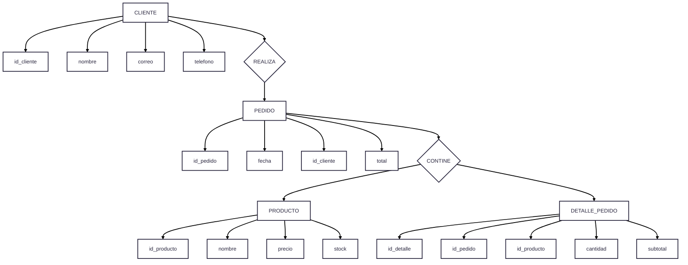

## Tarea #2
### Universidad Autonoma de Nuevo León - FCFM
#### Maestría en Ciencia de Datos - Bases de Datos Relacionales

```mermaid
---
config:
  theme: redux
  layout: fixed
---
flowchart TD
    cliente["CLIENTE"] --> c1["id_cliente"] & c2["nombre"] & c3["correo"] & c4["telefono"] & rel1["REALIZA"]
    producto["PRODUCTO"] --> p1["id_producto"] & p2["nombre"] & p3["precio"] & p4["stock"]
    pedido["PEDIDO"] --> pe1["id_pedido"] & pe2["fecha"] & pe3["id_cliente"] & pe4["total"] & rel2["CONTINE"]
    detalle["DETALLE_PEDIDO"] --> d1["id_detalle"] & d2["id_pedido"] & d3["id_producto"] & d4["cantidad"] & d5["subtotal"]
    rel1 --> pedido
    rel2 --> producto & detalle

    rel1@{ shape: diam}
    rel2@{ shape: diam}
     cliente:::entidad
     rel1:::relacion
     producto:::entidad
     pedido:::entidad
     rel2:::relacion
     detalle:::entidad

```