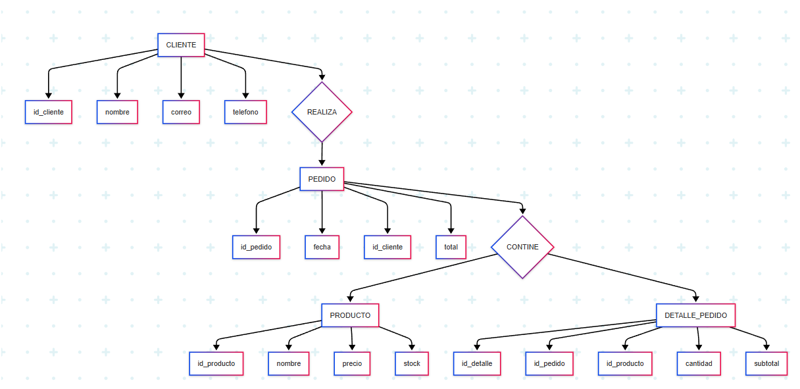

## Tarea #2
### Universidad Autonoma de Nuevo León - FCFM
#### Maestría en Ciencia de Datos - Bases de Datos Relacionales

### Tabla: Cliente
Atributo	Tipo de Dato	Descripción
id_cliente	INT / SERIAL	Clave primaria, autoincremental
nombre	    VARCHAR(100)	Nombre del cliente
correo	    VARCHAR(150)	Correo electrónico
telefono	VARCHAR(15)	    Número de teléfono (texto libre)

### Tabla: Producto
Atributo	Tipo de Dato	Descripción
id_producto	INT / SERIAL	Clave primaria
nombre	    VARCHAR(100)	Nombre del producto
precio	    DECIMAL(10,2)	Precio unitario con 2 decimales
stock	    INT	            Existencias disponibles

### Tabla: Pedido
Atributo	Tipo de Dato	Descripción
id_pedido	INT / SERIAL	Clave primaria
fecha	    DATE	        Fecha del pedido
id_cliente	INT	            Clave foránea hacia Cliente
total	    DECIMAL(10,2)	Total de la compra

### Tabla: DetallePedido
Atributo	Tipo de Dato	Descripción
id_detalle	INT / SERIAL	Clave primaria
id_pedido	INT	            Clave foránea hacia Pedido
id_producto	INT	            Clave foránea hacia Producto
cantidad	INT	            Cantidad comprada del producto
subtotal	DECIMAL(10,2)	Total parcial (cantidad × precio)

### Relaciones:
- Un **cliente** puede realizar varios **pedidos**. (1:N)
- Un **pedido** puede incluir varios **productos**, y un **producto** puede pertenecer a varios **pedidos**. (N:N, resuelta con la tabla `DetallePedido`)

### Modelo E-R

