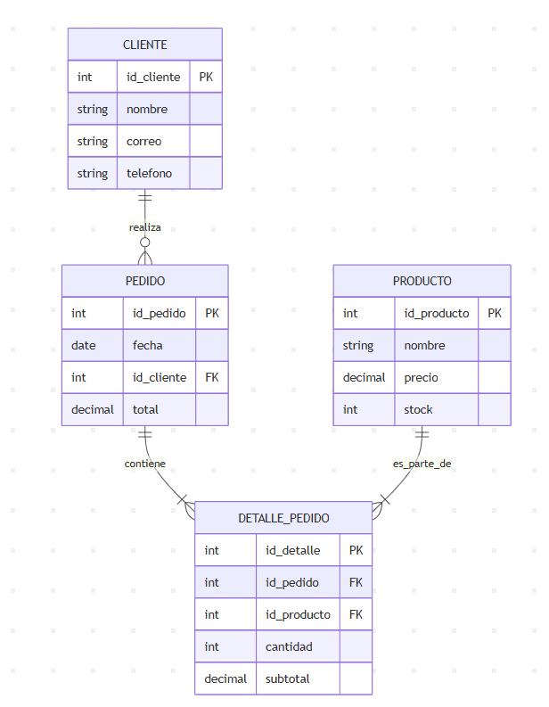

# Tarea #3
### Universidad Autonoma de Nuevo León - FCFM
#### Maestría en Ciencia de Datos - Bases de Datos Relacionales

# Modelo Relacional
La Base de Datos se puede representar mediante el siguiente esquema:
(PK) = PRIMARY KEY
(FK) = FOREIGN KEY

# CLIENTE
id_cliente (PK)

nombre

correo

teléfono

# PRODUCTO
id_producto (PK)

nombre

precio

stock

# PEDIDO
id_pedido (PK)

fecha

id_cliente (FK)

total

# DETALLE PEDIDO
id_detalle (PK)

id_pedido (FK)

id_producto (FK)

cantidad

subtotal

# RELACIONES
Un cliente puede realizar muchos pedidos
→ Relación: CLIENTE (1) — (N) PEDIDO

Un pedido puede tener muchos productos
y un producto puede estar en muchos pedidos
→ Relación N:M entre PEDIDO y PRODUCTO, resuelta con la tabla DETALLE_PEDIDO

DETALLE_PEDIDO actúa como entidad débil que une PEDIDO y PRODUCTO mediante claves foráneas.

### DIAGRAMA RELACIONAL

### OPERACIONES

| Tipo de Operación | Expresión en Álgebra Relacional | Descripción          |
|-------------------|---------------------------------|----------------------|
| Selección         | σ id_cliente = 5 (PEDIDO)       | Obtiene todos los pedidos realizados por el cliente con ID 5              |
| Proyección        | π nombre (PRODUCTO)             | Muestra solo los nombres de los productos sin duplicados                |
| Unión             | π id_producto (σ id_pedido = 101 (DETALLE_PEDIDO)) ⋃  |
|                   | π id_producto (σ id_pedido = 102 (DETALLE_PEDIDO))     | Une los productos de dos pedidos distintos                                 |
| Join (Natural)    | CLIENTE ⨝ PEDIDO               | Combina cliente con sus pedidos mediante el atributo común `id_cliente`   |

